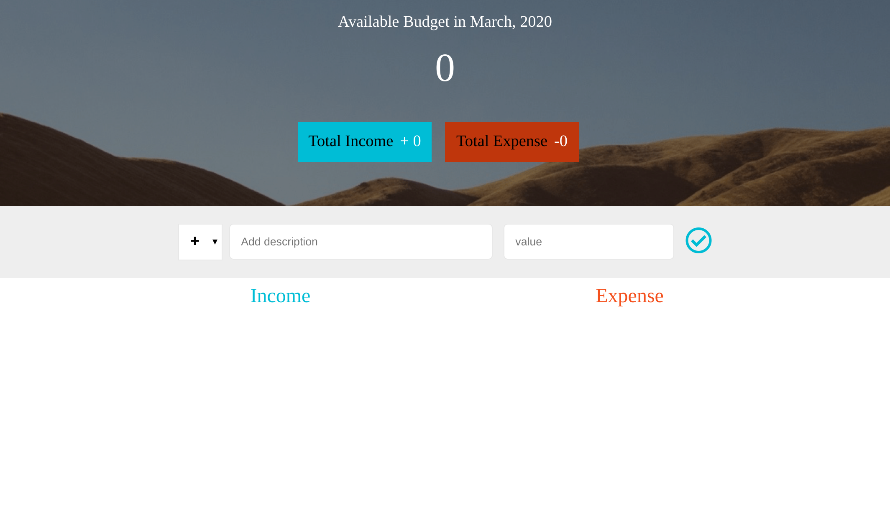
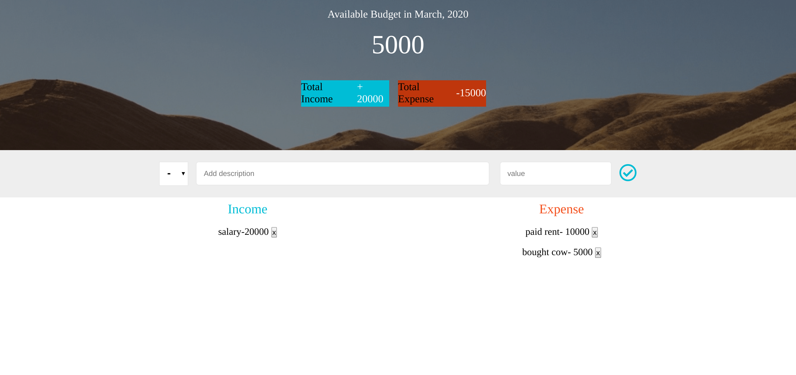

## PROJECT: Budget-App in React

this is a simple react applicaton to help manage a given budget. A user can enter either income or expense and the total budget will be reflect. user can also delete either income or expense and the correct total budget will be reflected.

## initial screen

## screen with data

## Built With

- HTML5
- CSS3
- Reactjs
- Contect API

## Author Emmanuel Chirchir

- Github: [@githubhandle](https://github.com/chirchir12)
- Twitter: [@twitterhandle](https://twitter.com/shadochir)
- Linkedin: [linkedin](https://www.linkedin.com/in/emmanuel-chirchir/)
- Email: [email](chirchir7370@gmail.com)

## Author Caleb

## Getting started

- Clone the repository with:
  `https://github.com/chirchir12/caleb-chirchir-budget-react-app.git`
- cd to `caleb-chirchir-budget-react-app`
- run `npm install`
- run `npm start`

## 🤝 Contributing

Contributions, issues and feature requests are welcome!

Feel free to check the [issues page](issues/).

## Show your support

Give a ⭐️ if you like this project!

## 📝 License

This project is [MIT](lic.url) licensed.
